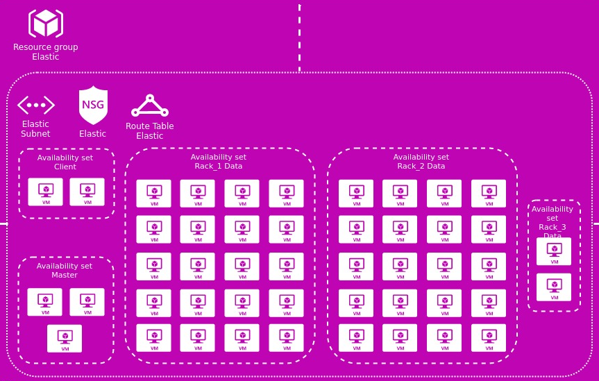

# terraform-modules-elastic #

Create a Elastic Search cluster in Azure
==============================================================================

This Terraform module create a elastic search cluster in Azure following Neoway rules.



The resources below will be created:

 * elastic subnet
 * elastic NSG
 * elastic route table
 * available set for master nodes
 * master nodes
 * available set for client nodes
 * client nodes
 * available set for data nodes in rack 1
 * data nodes in rack 1
 * available set for data nodes in rack 2 (optional)
 * data nodes in rack 2 (optional)
 * available set for data nodes in rack 3 (optional)
 * data nodes in rack 3 (optional)
 * available set for data nodes in rack 4 (optional)
 * data nodes in rack 4 (optional)

Usage
-----

```hcl
module "elastic" {
    source                = "git::ssh://git@gitlab.neoway.com.br:10022/labs/terraform-modules.git//azure/modules/elastic"
    location              = "eastus"
    env                   = "qa"
    name                  = "es5"
    vnet_name             = "qa-vnet"
	vnet_resource_group   = "qa-network"
    subnet_address_prefix = "10.0.10.0/24"
    security_group_rules  = "${local.nsg_rules}"
    route_table_routes    = "${local.rt_routes}"

    master_nb_instances       = "3"
    master_private_ip_address = ["10.0.10.10","10.0.10.11","10.0.10.12"]

    client_nb_instances       = "2"
    client_private_ip_address = ["10.0.10.20","10.0.10.21"]

    rack_1_data_nb_instances              = "10"
    rack_1_data_avset_update_domain_count = "10"
    rack_1_data_avset_fault_domain_count  = "2"

    elastic_username       = "elastic"
    elastic_public_ssh_key = "~/.ssh/id_rsa.pub"
}

locals {
    nsg_rules                     = [
      {
        name                       = "allow-inbound-subnets-to-elastic"
        priority                   = "1000"
        direction                  = "Inbound"
        access                     = "Allow"
        protocol                   = "tcp"
        source_port_range          = "*"
        source_address_prefix      = "VirtualNetwork"
        destination_port_range     = "9200"
        destination_address_prefix = "10.0.10.0/24"
        description                = "Allow inbound packets from vnet to access elastic"
      }
    ]

    rt_routes                     = []
}
```

Required Inputs
----
These variables must be set in the module block when using this module.

#### name
Description: This name will be use with a prefix for name of resource group, subnet, nsg, route table, instances

#### vnet_name
Description: Name of the vnet to associate.

#### vnet_resource_group
Description: Resource group name that the virtual network was provisioned in.

#### subnet_address_prefix
Description: The address prefix to use for the subnet.

#### rack_1_data_nb_instances
Description: Specify the number of instances of data node in rack 1.

Optional Inputs
----

These variables have default values and don't have to be set to use this module. You may set these variables to override their default values.

#### env
Description: Environment to orchestrate. This name will be use with a prefix for name of resource group, subnet, nsg, route table, instances
 - default: "test"

#### location
Description: The location/region where the virtual network is created. Changing this forces a new resource to be created.
 - default: "eastus2"

#### security_group_rules
Description: Security rules for the network security group using this format name = [priority, direction, access, protocol, source_port_range, source_address_prefix, destination_port_range, destination_address_prefix, description]
 - type: "list"
 - default: []

#### route_table_routes
Description: Routes for the route table using this format name = [name, address_prefix, next_hop_type, next_hop_in_ip_address]
 - type: "list"
 - default: []

#### elastic_username
Description: The elastic username of the VM that will be deployed
 - default: "bootstrap"

#### elastic_public_ssh_key
Description: Path to the public key to be used for ssh access to the VM.  Only used with non-Windows vms and can be left as-is even if using Windows vms. If specifying a path to a certification on a Windows machine to provision a linux vm use the / in the path versus backslash. e.g. c:/home/id_rsa.pub
 - default: "~/.ssh/id_rsa.pub"

#### master_nb_instances
Description: Specify the number of instances of master node.
 - default: "3"

#### master_vm_size
Description: Specifies the size of the virtual machine for master node.
 - default: "Standard_DS2_v2"

#### master_private_ip_address
Description: A list of static IP address for each master node.
 - default: [""]

#### client_nb_instances
Description: Specify the number of instances of client node.
 - default: "2"

#### client_vm_size
Description: Specifies the size of the virtual machine for client node.
 - default: "Standard_DS13_v2"

#### client_private_ip_address
Description: A list of static IP address for each client node.
 - default: [""]

#### data_vm_size
Description: Specifies the size of the virtual machine for data node.
 - default: "Standard_L8s"

#### rack_1_data_avset_update_domain_count
Description: Specifies the number of update domains that are used for rack 1.
 - default: "20"

#### rack_1_data_avset_fault_domain_count
Description: Specifies the number of fault domains that are used for rack 1.
 - default: "2"

#### rack_2_data_nb_instances
Description: Specify the number of instances of data node in rack 2.
 - default: "0"

#### rack_2_data_avset_update_domain_count
Description: Specifies the number of update domains that are used for rack 2.
 - default: "20"

#### rack_2_data_avset_fault_domain_count
Description: Specifies the number of fault domains that are used for rack 2.
 - default: "2"

#### rack_3_data_nb_instances
Description: Specify the number of instances of data node in rack 3.
 - default: "0"

#### rack_3_data_avset_update_domain_count
Description: Specifies the number of update domains that are used for rack 3.
 - default: "20"

#### rack_3_data_avset_fault_domain_count
Description: Specifies the number of fault domains that are used for rack 3.
 - default: "2"

#### rack_4_data_nb_instances
Description: Specify the number of instances of data node in rack 4.
 - default: "0"

#### rack_4_data_avset_update_domain_count
Description: Specifies the number of update domains that are used for rack 4.
 - default: "20"

#### rack_4_data_avset_fault_domain_count
Description: Specifies the number of fault domains that are used for rack 4.
 - default: "2"

Outputs
----

#### subnet_id
Description: The id of subnet created inside the vnet

#### subnet_name
Description: The Name of the newly created subnet

#### subnet_address_prefix
Description: The address prefix for the newly created subnet

#### subnet_nsg_id
Description: The id of NSG created and associated to the newly subnet

#### subnet_route_table_id
Description: The id of route table created and associated to the newly subnet

#### master_vm_ids
Description: Master virtual machine ids created.

#### client_vm_ids
Description: Client virtual machine ids created.

#### rack_1_data_vm_ids
Description: Data virtual machine ids created in rack 1.

#### rack_2_data_vm_ids
Description: Data virtual machine ids created in rack 2.

#### rack_3_data_vm_ids
Description: Data virtual machine ids created in rack 3.

#### rack_4_data_vm_ids
Description: Data virtual machine ids created in rack 4.

#### master_network_interface_ids
Description: ids of the master vm nics provisoned.

#### client_network_interface_ids
Description: ids of the client vm nics provisoned.

#### rack_1_data_network_interface_ids
Description: ids of the data vm nics provisoned in rack 1.

#### rack_2_data_network_interface_ids
Description: ids of the data vm nics provisoned in rack 2.

#### rack_3_data_network_interface_ids
Description: ids of the data vm nics provisoned in rack 3.

#### rack_4_data_network_interface_ids
Description: ids of the data vm nics provisoned in rack 4.

#### master_network_interface_private_ips
Description: private ip addresses of the master vm nics

#### client_network_interface_private_ips
Description: private ip addresses of the client vm nics

#### rack_1_data_network_interface_private_ips
Description: private ip addresses of the data vm nics in rack 1

#### rack_2_data_network_interface_private_ips
Description: private ip addresses of the data vm nics in rack 2

#### rack_3_data_network_interface_private_ips
Description: private ip addresses of the data vm nics in rack 3

#### rack_4_data_network_interface_private_ips
Description: private ip addresses of the data vm nics in rack 4

#### master_availability_set_id
Description: id of the availability set where the master vms are provisioned.

#### client_availability_set_id
Description: id of the availability set where the client vms are provisioned.

#### rack_1_data_availability_set_id
Description: id of the availability set where the data vms are provisioned in rack 1.

#### rack_2_data_availability_set_id
Description: id of the availability set where the data vms are provisioned in rack 2.

#### rack_3_data_availability_set_id
Description: id of the availability set where the data vms are provisioned in rack 3.

#### rack_4_data_availability_set_id
Description: id of the availability set where the data vms are provisioned in rack 4.

