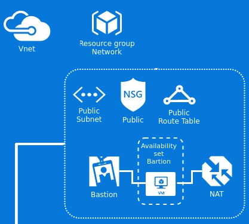

# terraform-modules-public-network #

Create a public network in Azure
==============================================================================

This Terraform module create a public network in Azure following Neoway rules.



The resources below will be created:

 * vnet
 * public subnet
 * public NSG
 * public route table
 * bastion + NAT host

Usage
-----

```hcl
module "public" {
    source                = "git::ssh://git@gitlab.neoway.com.br:10022/labs/terraform-modules.git//azure/modules/public-network"
    env                   = "qa"
    location              = "eastus"
    vnet_address_space    = ["10.0.0.0/16"]
    subnet_address_prefix = "10.0.1.0/24"
    security_group_rules  = "${local.nsg_rules}"
    route_table_routes    = "${local.rt_routes}"

    bastion_private_ip_address = "10.141.1.150"
    bastion_admin_username     = "bootstrap"
    bastion_public_ssh_key     = "~/.ssh/id_rsa.pub"
}

locals {
    nsg_rules                     = [
      {
        name                       = "allow-inbound-subnets-to-internet"
        priority                   = "4000"
        direction                  = "Inbound"
        access                     = "Allow"
        protocol                   = "*"
        source_port_range          = "*"
        source_address_prefix      = "VirtualNetwork"
        destination_port_range     = "80"
        destination_address_prefix = "Internet"
        description                = "Allow inbound packets from subnets access to internet"
      }
    ]

    rt_routes                     = []
}
```

Required Inputs
----
These variables must be set in the module block when using this module.

#### bastion_private_ip_address
Description: private ip address to bastion instance

#### bastion_public_ssh_key
Description: public ssh key to bastion virtual machine

Optional Inputs
----

These variables have default values and don't have to be set to use this module. You may set these variables to override their default values.

#### env
Description: Environment to orchestrate. This name will be use with a prefix for resource group, subnet, nsg, route table names
 - default: "test"

#### location
Description: The location/region where the subnet will be created. The full list of Azure regions can be found at https://azure.microsoft.com/regions
 - default: "eastus2"

#### vnet_address_space
Description: A list of address space that will be used by the virtual network.
 - type: "list"
 - default: ["10.0.0.0/16"]

#### dns_servers
Description: The DNS servers to be used with vnet. If no values specified, this defaults to Azure DNS
 - default: []

#### subnet_address_prefix
Description: The address prefix to use for the public subnet.
 - default: "10.0.1.0/24"

#### security_group_rules
Description: Security rules for the network security group using this format name = [priority, direction, access, protocol, source_port_range, source_address_prefix, destination_port_range, destination_address_prefix, description]
 - type: "list"
 - default: []

#### route_table_routes
Description: Routes for the route table using this format name = [name, address_prefix, next_hop_type, next_hop_in_ip_address]
 - type: "list"
 - default: []

#### bastion_avset_fault_domain_count
Description: number of update domains to bastion virtual machines
 - default: "2"

#### bastion_avset_update_domain_count
Description: number of fault domains to bastion virtual machines
 - default: "2"

#### bastion_virtual_machine_instance_size
Description: instance size to bastion virtual machine
 - default: "Standard_DS2_v2"

#### bastion_os_simple
Description: Specify UbuntuServer, RHEL, openSUSE-Leap, CentOS, Debian, CoreOS and SLES to get the latest image version of the specified os.  Do not provide this value if a custom value is used for vm_os_publisher, vm_os_offer, and vm_os_sku.
 - default: "UbuntuServer"

#### bastion_admin_username
Description: name of the administrator account
 - default: "bootstrap"

Outputs
----

#### vnet_id
Description: The id of the newly created vNet

#### vnet_name
Description: The Name of the newly created vNet

#### resource_group_name
Description: The resource group of public network created

#### vnet_address_space
Description: A list of address space of the newly created vNet

#### public_network_location
Description: The location of the public network

#### public_network_subnet_id
Description: The id of public subnet

#### public_network_subnet_name
Description: The Name of the public subnet

#### public_network_subnet_address_prefix
Description: The address prefix for the public subnet

#### public_network_nsg_id
Description: The id of the public NSG

#### public_network_route_table_id
Description: The id of the public route table

#### public_network_bastion_vm_id
Description: The bastion virtual machine ID

#### public_network_bastion_private_ip
Description: The bastion private ip address

#### public_network_bastion_avset_id
Description: The bastion availability set id

